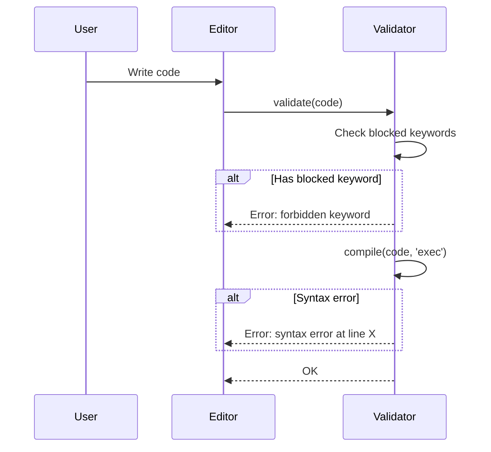
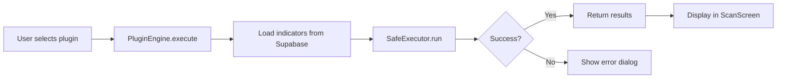

# Design: Custom Indicator Plugin System

## Overview
本設計文件說明插件系統的架構決策與技術實作細節。

---

## 1. Plugin Code Structure

### User-Defined Plugin Template
```python
# metadata
PLUGIN_NAME = "MFI 超買掃描"
PLUGIN_DESC = "找出 MFI > 70 的股票"

def scan(data, params):
    """
    Args:
        data: dict[stock_code] -> dict of indicators
              e.g. {"2330": {"close": 580, "volume": 50000, "mfi14": 75, ...}}
        params: dict with keys:
              - min_vol: minimum volume filter
              - limit: max results to return
    
    Returns:
        list of tuples: [(code, sort_value, indicators_dict), ...]
    """
    results = []
    for code, ind in data.items():
        vol = safe_float(ind.get('volume', 0))
        if vol < params['min_vol']:
            continue
        
        mfi = safe_float(ind.get('mfi14', 0))
        if mfi and mfi > 70:
            results.append((code, mfi, ind))
    
    return sorted(results, key=lambda x: x[1], reverse=True)[:params['limit']]
```

### Available Data Fields
從 Supabase `stock_data` 表提供的欄位：

| Field | Type | Description |
|-------|------|-------------|
| `code` | str | 股票代碼 |
| `name` | str | 股票名稱 |
| `close` | float | 收盤價 |
| `volume` | int | 成交量 (股) |
| `ma3`, `ma20`, `ma60`, `ma120`, `ma200` | float | 均線 |
| `mfi14`, `mfi14_prev` | float | MFI 指標 |
| `rsi6`, `rsi12` | float | RSI 指標 |
| `vp_upper`, `vp_lower` | float | VP 上下緣 |
| `month_k`, `month_d` | float | 月 KD |
| `smart_score` | int | 聰明錢分數 (0-5) |
| `smi`, `svi`, `nvi` | float | 聰明錢指標 |
| `vsa_signal` | int | VSA 訊號 |

---

## 2. Security Model

### Restricted Namespace
```python
SAFE_BUILTINS = {
    'True': True, 'False': False, 'None': None,
    'abs': abs, 'min': min, 'max': max, 'sum': sum,
    'len': len, 'range': range, 'sorted': sorted,
    'list': list, 'dict': dict, 'tuple': tuple,
    'int': int, 'float': float, 'str': str, 'bool': bool,
    'round': round, 'enumerate': enumerate, 'zip': zip,
}

BLOCKED_KEYWORDS = [
    'import', 'from', 'exec', 'eval', 'compile',
    'open', 'file', '__', 'globals', 'locals',
    'getattr', 'setattr', 'delattr', 'hasattr',
    'os', 'sys', 'subprocess', 'socket', 'requests',
]
```

### Validation Flow


---

## 3. Plugin Persistence

### JSON Schema
```json
{
  "version": 1,
  "plugins": [
    {
      "id": "mfi_overbought",
      "name": "MFI 超買掃描",
      "desc": "找出 MFI > 70 的股票",
      "code": "def scan(data, params):\n    ...",
      "enabled": true,
      "builtin": false,
      "created_at": "2025-12-06T09:00:00Z",
      "updated_at": "2025-12-06T09:00:00Z"
    }
  ]
}
```

### Storage Location
- **Android**: `/data/data/<package>/files/user_plugins.json`
- **Windows (dev)**: `./data/user_plugins.json`

---

## 4. Plugin Execution Flow



### SafeExecutor Implementation
```python
class SafeExecutor:
    def run(self, code: str, data: dict, params: dict) -> list:
        # Create restricted globals
        globals_dict = {
            '__builtins__': SAFE_BUILTINS,
            'safe_float': safe_float,
            'safe_int': safe_int,
            # ... other helpers
        }
        locals_dict = {
            'data': data,
            'params': params,
        }
        
        # Execute in sandbox
        exec(code, globals_dict, locals_dict)
        
        # Call the scan function
        if 'scan' not in locals_dict:
            raise PluginError("Missing 'scan' function")
        
        return locals_dict['scan'](data, params)
```

---

## 5. UI Layout

### Plugin Editor Screen
```
┌─────────────────────────────────────────┐
│  ← 編輯自訂掃描                          │
├─────────────────────────────────────────┤
│  名稱: [________________]               │
│  說明: [________________]               │
├─────────────────────────────────────────┤
│  ┌─────────────────────────────────┐    │
│  │ def scan(data, params):         │    │
│  │     results = []                │    │
│  │     for code, ind in data.items│    │
│  │         vol = safe_float(ind.ge│    │
│  │         ...                     │    │
│  │                                 │    │
│  └─────────────────────────────────┘    │
│                          [▲] [▼] scroll │
├─────────────────────────────────────────┤
│  [語法檢查]  [測試執行]     [儲存] [取消]│
└─────────────────────────────────────────┘
```

---

## 6. Error Handling

| Error Type | UI Response |
|------------|-------------|
| Syntax Error | 顯示行號 + 錯誤訊息 |
| Blocked Keyword | 顯示被阻擋的關鍵字列表 |
| Runtime Error | 顯示 exception 訊息 |
| No 'scan' function | 提示：請定義 `def scan(data, params):` |
| Wrong return type | 提示：scan 必須回傳 list |

---

## 7. Trade-offs

### Approach 1: Full Python Interpreter (選用)
- **優點**: 完整 Python 語法支援
- **缺點**: 安全風險高，需仔細限制

### Approach 2: DSL (Domain-Specific Language)
- **優點**: 安全，容易驗證
- **缺點**: 用戶需學習新語法，彈性有限

### Decision
選擇 **Approach 1 + 嚴格 namespace 限制**，因為：
1. 用戶熟悉 Python
2. 透過移除危險 builtins 可達到足夠安全
3. 保持最大彈性
