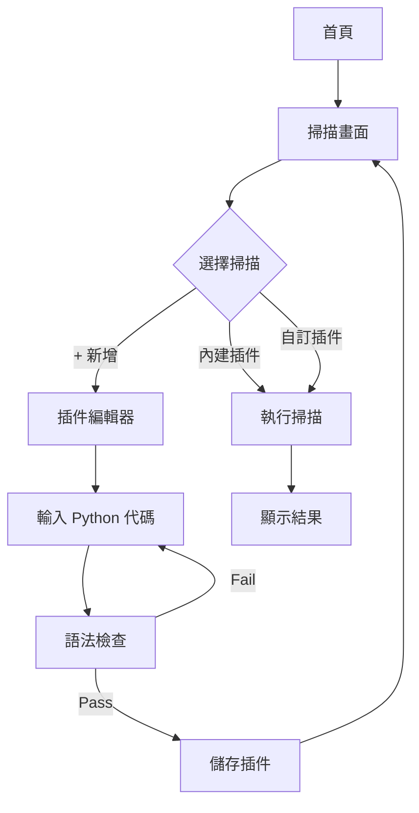
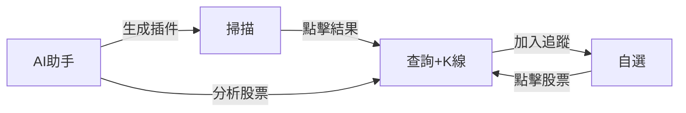

# Change: Add Custom Indicator Plugin System for Android APK

## Why
用戶希望將 `最終修正.py` 打包成 APK，並且將「市場掃描」功能改為 **插件系統**，讓用戶可以輸入 Python 代碼來建立客製化的指標掃描策略。同時新增完整的 **K 線圖分析功能**。

## 核心特點

### 1️⃣ 插件系統
- 🔌 **插件架構** - 市場掃描從固定清單變成可擴展的插件
- 📝 **Python 代碼編輯器** - App 內撰寫自訂指標
- 🔒 **安全沙盒** - 禁止危險操作 (import os, open 等)
- 💾 **CRUD 管理** - 新增/編輯/刪除插件
- ☁️ **雲端同步** - 插件設定同步到 Supabase

### 2️⃣ AI 輔助插件生成 (新增)
- 🔮 **自然語言輸入** - 用中文描述篩選條件，AI 自動生成代碼
- 🤖 **Gemini API** - 使用 Google Gemini 生成 Python 插件代碼
- 🔑 **用戶 API Key** - 在設定頁輸入自己的 Gemini API Key
- ✏️ **編輯確認** - AI 生成後用戶可編輯調整再儲存

### 3️⃣ K 線圖分析
- 📊 **K 線主圖** - 日/週/月 切換
- 📈 **均線疊加** - MA3/20/60/120/200 可選擇開關
- ✏️ **自訂均線** - 輸入任意週期 (1-500)，可選顏色與線型
- 🎯 **技術線條** - VP上/下界、POC、VWAP、止損、止盈
- 📉 **成交量副圖** - 紅綠柱狀圖
- 🔧 **指標副圖** - KD/MACD/RSI/MFI，或自訂插件指標

---

## User Review Required

> [!IMPORTANT]
> **安全性考量**: 在 Android 上執行用戶輸入的 Python 代碼有安全風險。建議方案：
> - 使用受限的 namespace，僅暴露必要的函數和資料
> - 禁止 `import`、`eval`、`open`、`os`、`sys` 等危險操作
> - 插件代碼僅能存取 `indicators_data` 和預定義的輔助函數

> [!WARNING]
> **Buildozer 限制**: Python-for-Android 需要將所有 dependency 預先編譯，插件**無法動態 import 新套件**。插件僅能使用 App 內建的函數。

---

## Proposed Changes

### Plugin Architecture (新增)

#### [NEW] `twse_app/src/plugin_engine.py`
插件引擎核心模組：
- `PluginEngine` class - 管理插件生命週期
- `PluginValidator` - 語法與安全性驗證
- `SafeExecutor` - 受限環境執行用戶代碼
- `PluginRegistry` - 插件註冊與載入

#### [NEW] `twse_app/src/plugin_helpers.py`
提供給插件使用的安全輔助函數：
- `safe_float(val)` - 安全數值轉換
- `filter_by_volume(data, min_vol)` - 成交量過濾
- `filter_by_indicator(data, key, min_val, max_val)` - 指標過濾
- `sort_results(data, key, desc=False)` - 結果排序

#### [NEW] `twse_app/data/default_plugins.json`
內建預設插件 (對應現有 7 種掃描)：
```json
[
  {"id": "smart_money", "name": "聰明錢掃描", "builtin": true},
  {"id": "triple_filter", "name": "三重篩選", "builtin": true},
  ...
]
```

#### [NEW] `twse_app/data/user_plugins.json`
用戶自訂插件儲存區

---

### Scan Screen Refactor (修改)

#### [MODIFY] `twse_app/screens/scan.py`
- 從 hardcoded `self.strategies[]` 改為動態載入 `PluginRegistry`
- 新增「+ 新增自訂掃描」按鈕
- 支援長按插件卡片顯示「編輯/刪除」選項

#### [NEW] `twse_app/screens/plugin_editor.py`
代碼編輯畫面：
- 多行 TextInput 作為 Python 代碼編輯器
- 語法檢查按鈕 (執行 `compile()` 測試)
- 執行測試按鈕 (用 10 筆資料預覽)
- 儲存按鈕

---

### Plugin Code Template

用戶撰寫插件的標準格式：

```python
# 插件名稱: 我的自訂掃描
# 描述: 找出 MFI > 70 且成交量 > 1000張的股票

def scan(data, params):
    """
    data: dict[code] -> indicators (如 close, volume, mfi14, ma200...)
    params: dict 包含 min_vol, limit
    return: list of (code, sort_value, indicators)
    """
    results = []
    for code, ind in data.items():
        vol = safe_float(ind.get('volume', 0))
        if vol < params['min_vol']:
            continue
        
        mfi = safe_float(ind.get('mfi14', 0))
        if mfi > 70:
            results.append((code, mfi, ind))
    
    return sorted(results, key=lambda x: x[1], reverse=True)
```

---

### App Flow Diagram


```mermaid
graph TB
    A[首頁] --> B[掃描畫面]
    B --> C{選擇掃描}
    C -->|內建插件| D[執行掃描]
    C -->|自訂插件| D
    C -->|+ 新增| E[插件編輯器]
    
    E --> F[輸入 Python 代碼]
    F --> G[語法檢查]
    G -->|Pass| H[儲存插件]
    G -->|Fail| F
    H --> B
    
    D --> I[顯示結果]
```

## App 導航架構 (5 個分頁)

| # | 圖標 | 名稱 | 主要功能 |
|---|------|------|----------|
| 1 | � | **查詢** | 搜尋股票 → 顯示 K 線圖分析 (同一頁) |
| 2 | 📈 | **掃描** | 內建 + 自訂插件掃描，點擊個股 → 顯示 K 線圖分析 (同一頁) |
| 3 | ⭐ | **自選** | 追蹤清單，點擊 → 顯示 K 線圖分析 (同一頁) |
| 4 | 🤖 | **AI助手** | 問 AI 股票問題、生成插件 |
| 5 | ⚙️ | **設定** | 系統狀態、API Key、資料管理 |

### 頁面流程


```mermaid
graph LR
    A[查詢+K線] -->|加入追蹤| C[自選]
    B[掃描] -->|點擊結果| A
    C -->|點擊股票| A
    D[AI助手] -->|生成插件| B
    D -->|分析股票| A
```

---

## 技術架構

```
┌─────────────────────────────────────────┐
│           Android App (Kivy)            │
├─────────────────────────────────────────┤
│  screens/ (5 個主畫面)                   │
│    ├── query.py (查詢 + K線圖)           │
│    ├── scan.py (市場掃描 + 插件)         │
│    ├── watchlist.py (自選股)            │
│    ├── ai_chat.py (AI 助手)             │
│    ├── settings.py (設定)               │
│    └── plugin_editor.py (插件編輯器)     │
├─────────────────────────────────────────┤
│  src/                                   │
│    ├── plugin_engine.py (插件引擎)       │
│    ├── plugin_helpers.py (安全函數庫)    │
│    ├── ai_generator.py (Gemini API)     │
│    ├── chart_engine.py (K線圖渲染)       │
│    └── supabase_client.py (資料來源)     │
├─────────────────────────────────────────┤
│  data/                                  │
│    ├── default_plugins.json (內建插件)   │
│    └── user_plugins.json (用戶插件)      │
└─────────────────────────────────────────┘
```

---

## K 線圖畫面規格

### 畫面佈局
```
┌─────────────────────────────────────────┐
│  2330 台積電              [日][週][月]   │ ← 標題 + 週期切換
├─────────────────────────────────────────┤
│  ┌─────────────────────────────────┐    │
│  │                                 │    │
│  │      K 線主圖 (OHLC)            │    │ ← 可左右滑動
│  │      + MA 均線疊加              │    │
│  │      + VP/VWAP/POC 線條         │    │
│  │                                 │    │
│  └─────────────────────────────────┘    │
│  ┌─────────────────────────────────┐    │
│  │      成交量副圖                  │    │
│  └─────────────────────────────────┘    │
│  ┌─────────────────────────────────┐    │
│  │      指標副圖 [KD ▼]            │    │ ← 下拉選擇
│  └─────────────────────────────────┘    │
├─────────────────────────────────────────┤
│ [MA3][MA20][MA60][MA120][MA200][+自訂]  │ ← 均線開關
│ [VP][VWAP][POC][止損][止盈]             │ ← 疊加線開關
└─────────────────────────────────────────┘
```

### 自訂均線對話框
- 週期輸入: 1-500 天
- 快速選擇: 3, 20, 60, 120, 200
- 顏色選擇: 預設 6 色 (藍/黃/紫/橙/白/粉)
- 線型選擇: 實線 / 虛線

### 指標副圖選項
- 內建: KD, MACD, RSI, MFI
- 自訂: 依插件定義的指標

---

## AI 助手頁面規格

### AI 助手佈局
```
┌─────────────────────────────────────────┐
│  🤖 AI 助手                              │
├─────────────────────────────────────────┤
│  ┌─────────────────────────────────┐    │
│  │ 👤: 2330 最近走勢如何？          │    │
│  │                                 │    │
│  │ 🤖: 台積電 (2330) 近期走勢分析:  │    │
│  │    - 收盤價: 1050               │    │
│  │    - MA20: 1020 (在均線上方)    │    │
│  │    - MFI: 65 (資金流入中)       │    │
│  │    ...                          │    │
│  └─────────────────────────────────┘    │
├─────────────────────────────────────────┤
│  [輸入問題...]              [🎤] [送出] │ ← 語音輸入
├─────────────────────────────────────────┤
│  快速提問:                               │
│  [生成插件] [分析股票] [解釋指標] [新聞]  │
└─────────────────────────────────────────┘
```

### AI 助手功能
| 功能 | 說明 |
|------|------|
| 股票分析 | 「2330 最近走勢如何？」- 提供技術面分析 |
| 指標解釋 | 「什麼是 MFI？」- 解釋技術指標含義 |
| 投資建議 | 「這檔股票適合買嗎？」- 提供參考 (含風險提示) |
| 相關新聞 | 「最近有什麼財經新聞？」- 提供市場動態 |
| 生成插件 | 「幫我建立 MFI > 70 的掃描」- 自然語言生成代碼 |

### AI 服務配置
- **使用 Gemini API**
- **API Key**: 用戶在設定頁輸入自己的 Key
- **語音輸入**: 按住 🎤 說話，語音轉文字

### AI 股票數據分析 (Context 功能)
當用戶詢問特定股票時，系統自動帶入即時數據給 AI：
```
用戶問: 「2330 適合買嗎？」

[系統自動附加的資料]:
- 收盤價: 1050
- MA20: 1020 (價格在均線上方 ✅)
- MFI: 72 (資金流入中 ✅)
- Smart Score: 4/5
- VP 位置: 接近上緣

AI 回覆: 根據技術面分析...（具體建議 + 風險提示）
```

---

## 設定頁面規格

### 設定頁面佈局
```
┌─────────────────────────────────────────┐
│  ⚙️ 設定              ☁️ 雲端讀取 [開關] │ ← 雲端/本地切換
├─────────────────────────────────────────┤
│  📊 系統狀態                             │
│  ├ 資料庫: /sdcard/.../stock.db [選擇]   │ ← 可自訂路徑
│  ├ 股票總數: 1897 檔                     │
│  └ 資料範圍: 2024-01-01 ~ 2025-12-06    │
├─────────────────────────────────────────┤

│  🔑 API Key 設定                         │
│  ├ FinMind Token: [****] [儲存]   ✅ 可用       │
│  └ Gemini API Key: [****] [儲存]  ✅ 可用      │
├─────────────────────────────────────────┤
│  ☁️ Supabase 雲端      ✅ 連線正常                   │
│  [更新三表] [下載到本地]                 │
│  ├ 上市(TWSE): ✅ 2025-12-06 (最新)      │
│  ├ 上櫃(TPEX): ⚠️ 2025-12-05 (落後1天)   │
│  └ 指標計算: ✅ 完成                     │
│  ⏰ 自動排程: 每日 16:00                 │
├─────────────────────────────────────────┤
│  💾 本地操作                             │
│  [更新三表] [上傳到雲端]                 │
│  ├ 上市(TWSE): ✅ 2025-12-06 (最新)      │
│  ├ 上櫃(TPEX): ⚠️ 2025-12-05 (落後1天)   │
│  └ 指標計算: ✅ 完成                     │
│  ⏰ 本地排程: [開關] 每日 16:00          │
├─────────────────────────────────────────┤
│  🔧 資料檢查    最後: 2025-12-05 15:30   │
│  [檢查數據缺失] [清理下市股票]            │
│  [驗證一致性並補漏] [計算技術指標]        │
└─────────────────────────────────────────┘
```

### 雲端/本地模式
| 模式 | 資料來源 |
|------|----------|
| ☁️ 雲端模式 | 從 Supabase 讀取指標資料 |
| 💾 本地模式 | 從本地 SQLite 讀取資料 |

### 資料更新優先順序
1. **FinMind API** (優先)
2. **官方 API** (備援)

### 深淺色主題切換
| 主題 | 配色 |
|------|------|
| 🌙 深色模式 | 背景 #102216，強調色 #13ec5b |
| ☀️ 淺色模式 | 背景 #f6f8f6，強調色 #13ec5b |

> 用戶可在設定頁切換主題，App 會記住偏好設定


### 資料檢查功能說明
| 功能 | 說明 |
|------|------|
| 檢查數據缺失 | 掃描資料庫中缺失的交易日資料 |
| 清理下市股票 | 移除已下市股票的歷史資料 |
| 驗證一致性並補漏 | 斷點續抓，補齊缺失資料 |
| 計算技術指標 | 重新計算所有股票的技術指標 |

---

## Verification Plan

### Local Tests (Python)
1. 在 Windows 上執行 Kivy App 測試:
   ```powershell
   cd d:\twse\twse_app
   python main.py
   ```
   - 驗證掃描畫面正確載入內建插件
   - 點擊「+ 新增」可進入編輯器
   - 輸入範例代碼後能通過語法檢查

### Manual Verification
1. **語法錯誤處理**: 輸入 `if x` (缺少冒號) 點擊檢查，應顯示錯誤訊息
2. **安全性阻擋**: 輸入 `import os` 應被拒絕
3. **掃描執行**: 使用內建「聰明錢掃描」確認能正常執行
4. **APK 編譯**: 推送 GitHub 後觸發 Actions 編譯 (需用戶確認 CI 配置)

---

## User Decisions ✅

| 問題 | 決定 |
|------|------|
| 代碼編輯器 UI 語法高亮 | ❌ 否 (保持簡單) |
| 插件分享 (導出/導入) | ✅ 是 |
| 雲端同步到 Supabase | ✅ 是 |
| K 線圖位置 | 在「查詢」頁內顯示 |
| AI 服務 | Gemini API (用戶輸入 API Key) |
| AI 助手分頁 | ✅ 新增 (問 AI 股票問題) |

### Supabase 同步機制
- 新增 `user_plugins` 表存儲用戶自訂插件
- 插件儲存時自動上傳至 Supabase
- App 啟動時從 Supabase 同步插件

### 插件分享機制
- 導出: 將單個插件匯出為 JSON 檔案
- 導入: 從 JSON 檔案匯入插件

