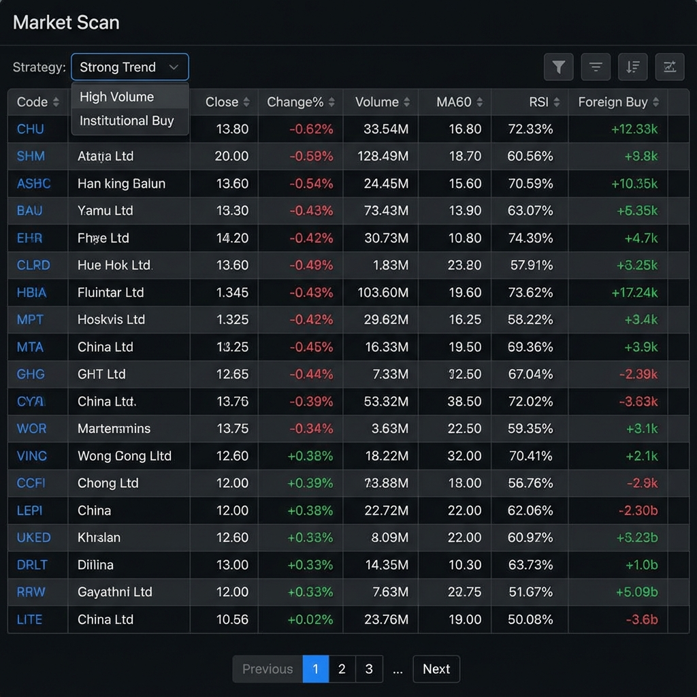
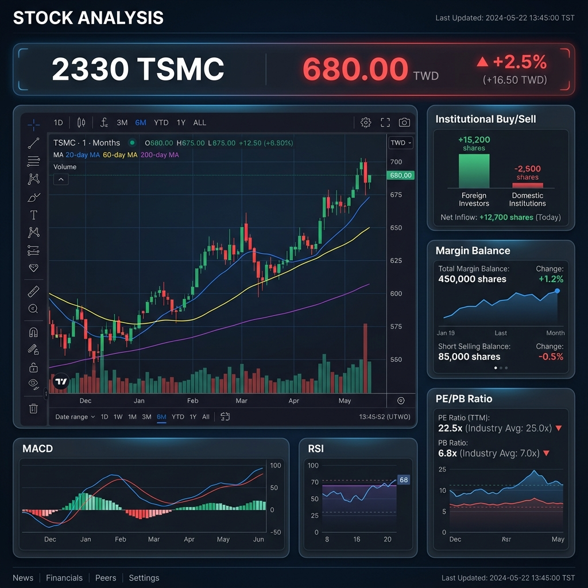
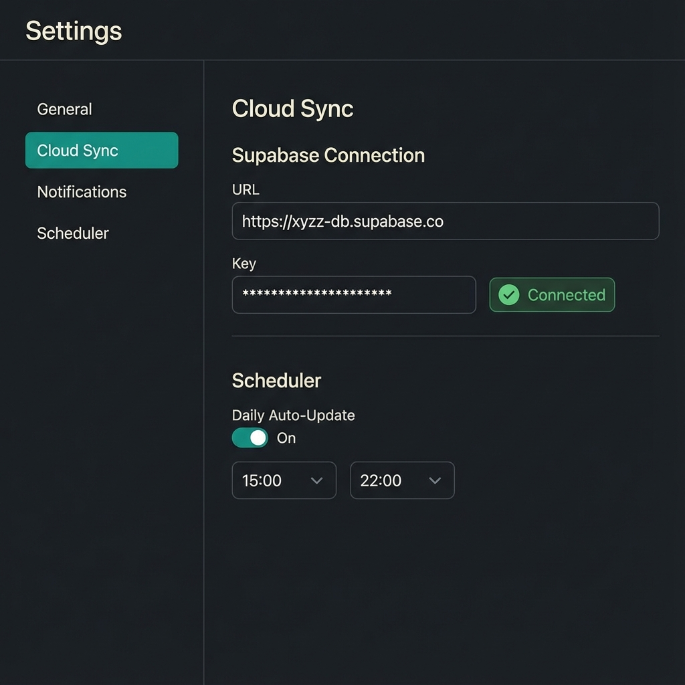

# 設計文件：網頁應用程式架構與 UI

## 背景 (Context)
使用者需要一個現代化、深色主題的網頁應用程式來取代 CLI。該應用程式必須支援每日自動更新和雲端同步。

## UI 示意圖 (UI Schematics)

### 1. 儀表板 (Dashboard)
市場狀態概覽與自選股清單。

### 2. 市場掃描 (Market Scan)
互動式資料表格，可根據技術指標篩選股票。

### 3. 個股分析 (Stock Analysis)
詳細頁面，包含 K 線圖、成交量與法人數據。

### 4. 設定 (Settings)
雲端同步與自動排程的設定介面。

## 圖表規格 (Chart Specifications)

### 主圖疊加指標 (Toggleable Overlays)
> 使用者可點擊圖例開關，自由選擇要顯示的指標

| 類別 | 可選指標 |
|------|----------|
| **均線** | MA5, MA20, MA60, MA120, MA200 |
| **加權均價** | VWAP, VWAP60, VWAP200 |
| **布林通道** | BBW (上軌/中軌/下軌) |
| **籌碼分布** | VP_upper, VP_lower, POC |
| **VSBC** | VSBC 區間線 |
| **斐波那契** | Fib_0618, Fib_0382, Fib_0.5 |

### 成交量圖 (Volume Chart)
- 成交量柱狀圖 (漲紅/跌綠)
- **Vol_MA5** (5日均量線)
- **Vol_MA60** (60日均量線)

### 副圖指標選單 (Sub-Chart Dropdown)
| 類別 | 指標 |
|------|------|
| 動能 | KD (日/週/月), RSI, MACD |
| 資金 | MFI, NVI, PVI, Smart Score |
| 籌碼 | ADL, CLV |
| 強度 | RS, Mansfield RS |

## 技術決策 (Technical Decisions)
- **前端框架**: React + Vite + TailwindCSS
- **後端框架**: FastAPI
- **資料庫策略**: 混合式 (本地 SQLite + Supabase 雲端)
- **部署**: GitHub Actions 自動化
