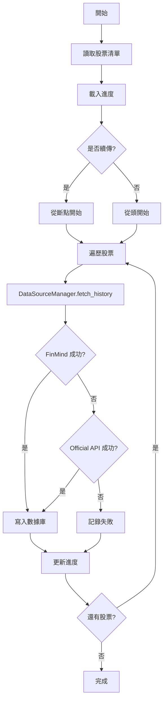
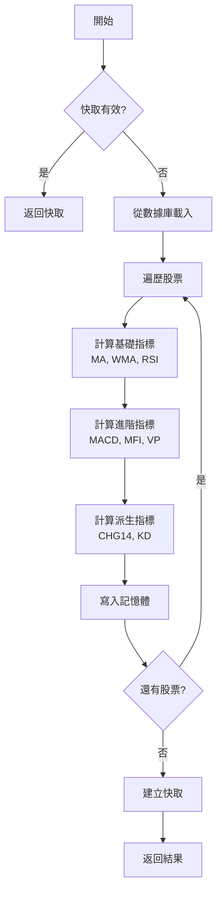

# 架構設計文檔 (Design Document)

## 1. 系統架構

### 1.1 整體架構圖

```
┌─────────────────────────────────────────────────────────┐
│                    用戶界面層 (UI Layer)                  │
│  - 菜單系統  - 進度顯示  - 用戶交互  - 結果展示          │
└──────────────────┬──────────────────────────────────────┘
                   │
┌──────────────────┴──────────────────────────────────────┐
│                業務邏輯層 (Business Logic Layer)          │
│  - 股票篩選  - 數據下載  - 指標計算  - 排行榜生成        │
└──────────────────┬──────────────────────────────────────┘
                   │
┌──────────────────┴──────────────────────────────────────┐
│                  技術指標層 (Indicator Layer)             │
│  - WMA  - RSI  - MACD  - MFI  - VP  - VWAP  - KD         │
└──────────────────┬──────────────────────────────────────┘
                   │
┌──────────────────┴──────────────────────────────────────┐
│                  數據源層 (Data Source Layer)             │
│  - FinMind API  - Official API  - 失敗轉移管理            │
└──────────────────┬──────────────────────────────────────┘
                   │
┌──────────────────┴──────────────────────────────────────┐
│                基礎設施層 (Infrastructure Layer)           │
│  - DatabaseManager  - ProgressTracker  - StockRepository │
└──────────────────┬──────────────────────────────────────┘
                   │
┌──────────────────┴──────────────────────────────────────┐
│                 工具函數層 (Utility Layer)                 │
│  - 數值轉換  - 日期處理  - 顏色格式  - 日誌系統          │
└──────────────────┬──────────────────────────────────────┘
                   │
┌──────────────────┴──────────────────────────────────────┐
│                   配置層 (Config Layer)                    │
│  - 環境檢測  - API URLs  - 常量定義  - 路徑設定          │
└─────────────────────────────────────────────────────────┘
```

### 1.2 模塊職責

| 層級 | 職責 | 關鍵類/函數 |
|------|------|------------|
| 配置層 | 環境適配、常量管理 | `get_work_directory()`, `IS_ANDROID` |
| 工具函數層 | 通用輔助功能 | `safe_num()`, `roc_to_western_date()`, `print_flush()` |
| 基礎設施層 | 數據庫、進度追蹤 | `DatabaseManager`, `ProgressTracker`, `StockRepository` |
| 數據源層 | API 數據獲取 | `FinMindDataSource`, `OfficialAPIDataSource`, `DataSourceManager` |
| 技術指標層 | 指標計算 | `IndicatorCalculator` (靜態方法) |
| 業務邏輯層 | 核心業務功能 | `download_stock_data()`, `calculate_indicators()`, `filter_stocks()` |
| 用戶界面層 | 菜單與交互 | `main_menu()`, `display_results()`, `read_single_key()` |

### 2.1 SingleWriterDBManager (單一寫入員資料庫管理器)

```python
class SingleWriterDBManager:
    """單一寫入員模式的資料庫管理器
    
    架構:
    - 所有寫入操作透過佇列序列化
    - 背景寫入線程 (Writer Thread) 批次處理
    - 讀取操作保持併發能力
    """
    
    _instance = None  # Singleton
    
    def __init__(self, db_path):
        self._write_queue = queue.Queue()
        self._writer_thread = threading.Thread(target=self._writer_loop, daemon=True)
        self._writer_thread.start()
    
    def _writer_loop(self):
        """背景寫入線程 - 批次處理寫入佇列"""
        while True:
            batch = self._collect_batch()  # 動態批次大小 (50-500)
            if batch:
                self._execute_batch(batch)
    
    def enqueue_write(self, operation: WriteOperation):
        """將寫入操作加入佇列"""
        self._write_queue.put(operation)
```

```
架構圖:
Callers (多線程)
    ↓
DBManager.get_connection()
    ↓
ProxyConnection (代理)
    ↓
┌──────────────┬──────────────┐
│ 讀取操作      │ 寫入操作      │
│ (SELECT)     │ (INSERT/     │
│              │  UPDATE/     │
│              │  DELETE)     │
│     ↓        │     ↓        │
│ 獨立連線     │ 寫入佇列     │
│     ↓        │     ↓        │
│              │ Writer Thread │
│              │ (單一線程)   │
└───────────────┴──────────────┘
           ↓
      SQLite DB
```

**設計要點:**
- Singleton 確保全局唯一實例
- 寫入操作透過佇列序列化，避免 "database is locked" 錯誤
- 動態批次大小 (50-500 筆依佇列深度自動調整)
- 保持現有 API 相容性 (透過 ProxyConnection)

### 2.2 Repository 層 (資料存取抽象)

```python
class HistoryRepository:
    """歷史資料存取層"""
    
    def get_history(self, code: str, limit: int = 400):
        """讀取歷史資料"""
    
    def get_latest_date(self, code: str):
        """取得指定股票的最新日期"""
    
    def upsert(self, code: str, records: List[Dict]):
        """批量寫入歷史資料"""

class SnapshotRepository:
    """快照資料存取層"""
    
    def get_snapshot(self, code: str):
        """讀取快照資料"""
    
    def upsert_indicators(self, code: str, date_int: int, indicators: Dict):
        """寫入指標快照"""
```

### 2.3 ProgressTracker (進度追蹤器)

```python
class ProgressTracker:
    """VT100 支持的進度追蹤器"""
    
    _lock = threading.Lock()  # 類級別鎖
    _last_update_time = 0
    _UPDATE_INTERVAL = 0.1  # 10 FPS 限流
    
    def update_lines(self, *messages, force=False):
        """線程安全的多行更新"""
    
    def _enable_windows_vt(self):
        """啟用 Windows VT100 支持"""
```

**設計要點:**
- 線程安全 (類級別鎖)
- 自動限流 (10 FPS)
- Windows VT100 支持

### 2.4 IndicatorCalculator (指標計算器)

```python
class IndicatorCalculator:
    """純靜態方法的指標計算器"""
    
    @staticmethod
    def calculate_wma(series, period):
        """加權移動平均"""
        # 權重: [1, 2, 3, ..., period]
        # WMA = Σ(價格 × 權重) / Σ權重
    
    @staticmethod
    def calculate_rsi(df, period=14):
        """RSI 指標 (使用 WMA)"""
        # RS = WMA(漲幅) / WMA(跌幅)
        # RSI = 100 - 100/(1+RS)
    
    @staticmethod
    def calculate_vp_scheme3(df, lookback=20):
        """Volume Profile 指標"""
        # POC: 成交量最大價格點
        # VA: 70% 成交量區域
```

**設計要點:**
- 純靜態方法，無狀態
- 所有指標使用 WMA 而非 EMA (系統特色)
- 返回序列版本供批量計算使用

### 2.5 DataSourceManager (數據源管理器)

```python
class DataSourceManager:
    """失敗轉移數據源管理器"""
    
    def __init__(self, progress_tracker=None):
        self.sources = [
            FinMindDataSource(...),      # 優先
            OfficialAPIDataSource(...)   # 備援
        ]
    
    def fetch_history(self, stock_code, ...):
        """依序嘗試所有數據源"""
        for source in self.sources:
            df = source.fetch_history(...)
            if df is not None:
                return df
        return None
```

**設計要點:**
- 失敗自動轉移
- 統一接口
- 進度追蹤集成

## 3. 數據流設計

### 3.1 數據下載流程



### 3.2 指標計算流程



## 4. 數據庫設計

###4.1 核心表結構

```sql
CREATE TABLE IF NOT EXISTS stock_data (
    code TEXT NOT NULL,           -- 股票代碼 (4位數字)
    name TEXT NOT NULL,           -- 股票名稱
    date TEXT NOT NULL,           -- 交易日期 (YYYY-MM-DD)
    open REAL,                    -- 開盤價
    high REAL,                    -- 最高價
    low REAL,                     -- 最低價
    close REAL NOT NULL,          -- 收盤價
    volume INTEGER,               -- 成交量 (股)
    close_prev REAL,              -- 前日收盤價
    vol_prev INTEGER,             -- 前日成交量
    PRIMARY KEY (code, date)
);

CREATE INDEX IF NOT EXISTS idx_code ON stock_data(code);
CREATE INDEX IF NOT EXISTS idx_date ON stock_data(date);
CREATE INDEX IF NOT EXISTS idx_code_date ON stock_data(code, date);
```

### 4.2 數據完整性規則

- `code` + `date` 為複合主鍵 (防止重複)
- `close` 不可為 NULL (核心數據)
- `close > 0` 驗證 (無效數據過濾)
- `close_prev` 和 `vol_prev` 用於計算漲跌幅

## 5. API 設計

### 5.1 FinMind API

```python
# 端點
URL = "https://api.finmindtrade.com/api/v4/data"

# 參數
params = {
    "dataset": "TaiwanStockPrice",
    "data_id": stock_code,
    "start_date": "2024-01-01",
    "end_date": "2024-12-31",
    "token": FINMIND_TOKEN
}

# 錯誤處理
- 429: 速率限制 (等待 2 秒重試)
- 非 200: 重試 3 次
- 無數據: 轉移到 Official API
```

### 5.2 Official API (TWSE + TPEx)

```python
# TWSE 端點
TWSE_URL = "https://www.twse.com.tw/rwd/zh/afterTrading/STOCK_DAY"
params = {"date": "20241201", "stockNo": "2330"}

# TPEx 端點
TPEX_URL = "https://www.tpex.org.tw/web/stock/aftertrading/daily_trading_info/st43_result.php"
params = {"d": "2024/12/01", "stk_code": "6472", "o": "json"}

# 策略
- 優先 TWSE，失敗則 TPEx
- 每月數據逐月抓取
- 最多 12 個月 (約 250 交易日)
```

## 6. 錯誤處理策略

### 6.1 異常分類

| 類型 | 處理策略 | 示例 |
|------|---------|------|
| 網絡錯誤 | 重試 3 次 | `requests.ConnectionError` |
| API 限速 | 等待後重試 | 429 狀態碼 |
| 數據錯誤 | 記錄並跳過 | 無效的股票代碼 |
| 數據庫錯誤 | 記錄並中止 | `sqlite3.OperationalError` |
| 系統錯誤 | 全局捕獲 | 未預期的異常 |

### 6.2 日誌策略

```python
# system.log
- INFO: 正常操作
- WARNING: 可恢復的錯誤
- ERROR: 嚴重錯誤

# 過濾 ANSI 顏色碼
clean_s = re.sub(r'\x1b\[[0-9;]*m', '', str(s))
```

## 7. 性能優化

### 7.1 數據庫優化
- WAL 模式 (非 Android)
- 批量插入 (executemany)
- 索引優化 (code, date)
- 連接池復用 (上下文管理器)

### 7.2 計算優化
- 使用 numpy 向量化操作
- 快取指標結果 (1小時過期)
- 只取 250 交易日 (減少計算量)
- 並發下載 (ThreadPoolExecutor)

### 7.3 UI 優化
- 進度限流 (10 FPS)
- 單鍵交互 (減少輸入)
- 分頁顯示 (避免刷屏)

## 8. 安全性設計

### 8.1 SQL 注入防護
```python
# 使用參數化查詢
cur.execute("SELECT * FROM stock_data WHERE code=?", (code,))

# 避免字符串拼接
# ❌ cur.execute(f"SELECT * FROM stock_data WHERE code='{code}'")
```

### 8.2 API Token 管理
```python
# 環境變量優先
FINMIND_TOKEN = os.getenv("FINMIND_TOKEN", DEFAULT_TOKEN)

# 避免硬編碼在代碼中 (僅提供默認值)
```

## 9. 測試策略

### 9.1 單元測試 (可選)
- 工具函數測試 (`safe_num`, `roc_to_western_date`)
- 指標計算測試 (WMA, RSI 準確性)

### 9.2 集成測試
- 數據下載流程測試
- 數據庫讀寫測試
- 指標批量計算測試

### 9.3 性能測試
- 1000 檔股票下載時間
- 內存峰值測試
- 並發安全測試
